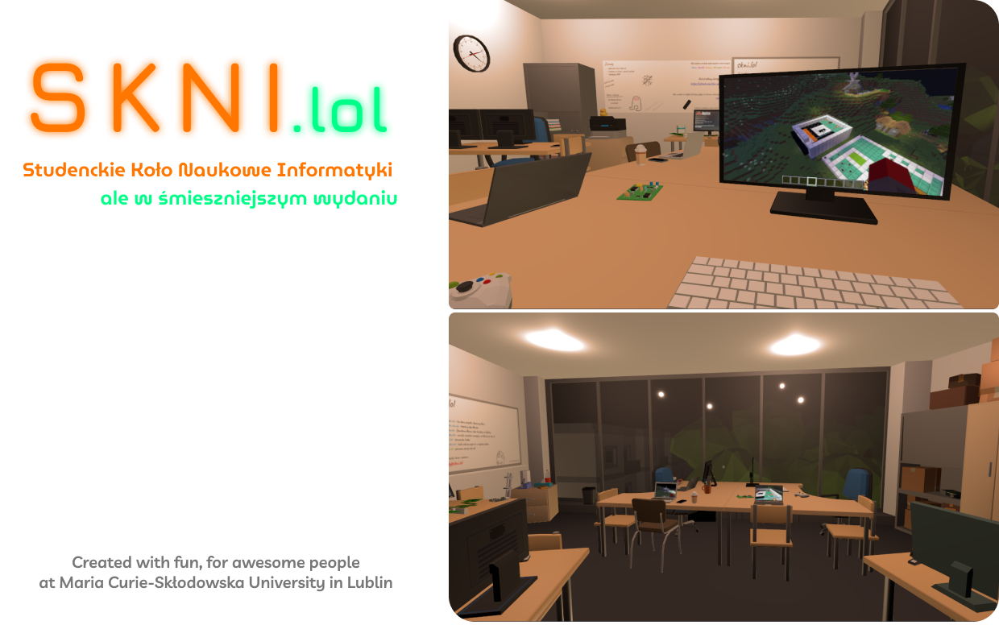

Website source code for _meme_ domain I've bought on Porkbun for $1.50 during _holiday deals_ sale. It was intended to be a funny, unofficial [skni.umcs.pl](https://skni.umcs.pl/) replacement and a creative way to play with React & R3F :D

## Installation

Prebuilt static files can be downloaded from **Releases.** Just unzip them to the root of your webserver.

- To run the development server:
```
npm i
npm run dev
```

- To run production one:
```
npm i
npm run build
npm run preview
```

## hmm?

**This website is not associated with SKNI nor UMCS.**
It's just a hobby side project I eventually shared with other students at SKNI.
Kinda joke, and kinda way to learn new things and have fun.
